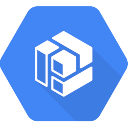

Node classes list of gcp provider.

## gcp.database

-  **diagrams.gcp.database.Bigtable**, **BigTable** (alias)
-  **diagrams.gcp.database.Datastore**
-  **diagrams.gcp.database.Firestore**
-  **diagrams.gcp.database.Memorystore**
-  **diagrams.gcp.database.Spanner**
-  **diagrams.gcp.database.SQL**

## gcp.security

-  **diagrams.gcp.security.Iam**
-  **diagrams.gcp.security.IAP**
-  **diagrams.gcp.security.KeyManagementService**, **KMS** (alias)
-  **diagrams.gcp.security.ResourceManager**
-  **diagrams.gcp.security.SecurityCommandCenter**, **SCC** (alias)
-  **diagrams.gcp.security.SecurityScanner**

## gcp.network

-  **diagrams.gcp.network.Armor**
-  **diagrams.gcp.network.CDN**
-  **diagrams.gcp.network.DedicatedInterconnect**
-  **diagrams.gcp.network.DNS**
-  **diagrams.gcp.network.ExternalIpAddresses**
-  **diagrams.gcp.network.FirewallRules**
-  **diagrams.gcp.network.LoadBalancing**
-  **diagrams.gcp.network.NAT**
-  **diagrams.gcp.network.Network**
-  **diagrams.gcp.network.PartnerInterconnect**
-  **diagrams.gcp.network.PremiumNetworkTier**
-  **diagrams.gcp.network.Router**
-  **diagrams.gcp.network.Routes**
-  **diagrams.gcp.network.StandardNetworkTier**
-  **diagrams.gcp.network.TrafficDirector**
-  **diagrams.gcp.network.VirtualPrivateCloud**, **VPC** (alias)
-  **diagrams.gcp.network.VPN**

## gcp.storage

-  **diagrams.gcp.storage.Filestore**
-  **diagrams.gcp.storage.PersistentDisk**
-  **diagrams.gcp.storage.Storage**, **GCS** (alias)

## gcp.iot

-  **diagrams.gcp.iot.IotCore**

## gcp.compute

-  **diagrams.gcp.compute.AppEngine**, **GAE** (alias)
-  **diagrams.gcp.compute.ComputeEngine**, **GCE** (alias)
-  **diagrams.gcp.compute.ContainerOptimizedOS**
-  **diagrams.gcp.compute.Functions**, **GCF** (alias)
-  **diagrams.gcp.compute.GKEOnPrem**
-  **diagrams.gcp.compute.GPU**
-  **diagrams.gcp.compute.KubernetesEngine**, **GKE** (alias)
-  **diagrams.gcp.compute.Run**

## gcp.devtools

-  **diagrams.gcp.devtools.Build**
-  **diagrams.gcp.devtools.CodeForIntellij**
-  **diagrams.gcp.devtools.Code**
-  **diagrams.gcp.devtools.ContainerRegistry**, **GCR** (alias)
-  **diagrams.gcp.devtools.GradleAppEnginePlugin**
-  **diagrams.gcp.devtools.IdePlugins**
-  **diagrams.gcp.devtools.MavenAppEnginePlugin**
-  **diagrams.gcp.devtools.Scheduler**
-  **diagrams.gcp.devtools.SDK**
-  **diagrams.gcp.devtools.SourceRepositories**
-  **diagrams.gcp.devtools.Tasks**
-  **diagrams.gcp.devtools.TestLab**
-  **diagrams.gcp.devtools.ToolsForEclipse**
-  **diagrams.gcp.devtools.ToolsForPowershell**
-  **diagrams.gcp.devtools.ToolsForVisualStudio**

## gcp.ml

-  **diagrams.gcp.ml.AdvancedSolutionsLab**
-  **diagrams.gcp.ml.AIHub**
-  **diagrams.gcp.ml.AIPlatformDataLabelingService**
-  **diagrams.gcp.ml.AIPlatform**
-  **diagrams.gcp.ml.AutomlNaturalLanguage**
-  **diagrams.gcp.ml.AutomlTables**
-  **diagrams.gcp.ml.AutomlTranslation**
-  **diagrams.gcp.ml.AutomlVideoIntelligence**
-  **diagrams.gcp.ml.AutomlVision**
-  **diagrams.gcp.ml.Automl**, **AutoML** (alias)
-  **diagrams.gcp.ml.DialogFlowEnterpriseEdition**
-  **diagrams.gcp.ml.InferenceAPI**
-  **diagrams.gcp.ml.JobsAPI**
-  **diagrams.gcp.ml.NaturalLanguageAPI**, **NLAPI** (alias)
-  **diagrams.gcp.ml.RecommendationsAI**
-  **diagrams.gcp.ml.SpeechToText**, **STT** (alias)
-  **diagrams.gcp.ml.TextToSpeech**, **TTS** (alias)
-  **diagrams.gcp.ml.TPU**
-  **diagrams.gcp.ml.TranslationAPI**
-  **diagrams.gcp.ml.VideoIntelligenceAPI**
-  **diagrams.gcp.ml.VisionAPI**

## gcp.migration

-  **diagrams.gcp.migration.TransferAppliance**

## gcp.analytics

-  **diagrams.gcp.analytics.Bigquery**, **BigQuery** (alias)
-  **diagrams.gcp.analytics.Composer**
-  **diagrams.gcp.analytics.DataCatalog**
-  **diagrams.gcp.analytics.DataFusion**
-  **diagrams.gcp.analytics.Dataflow**
-  **diagrams.gcp.analytics.Datalab**
-  **diagrams.gcp.analytics.Dataprep**
-  **diagrams.gcp.analytics.Dataproc**
-  **diagrams.gcp.analytics.Genomics**
-  **diagrams.gcp.analytics.Pubsub**, **PubSub** (alias)
