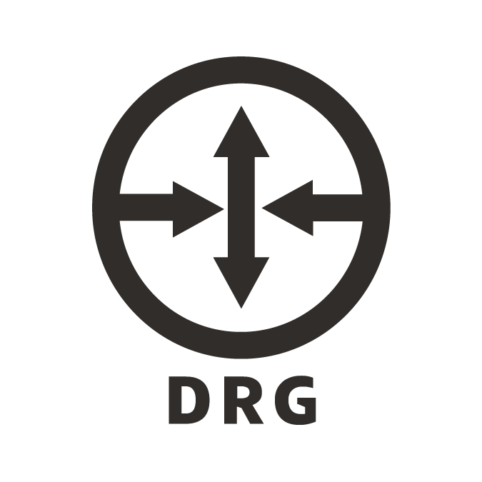
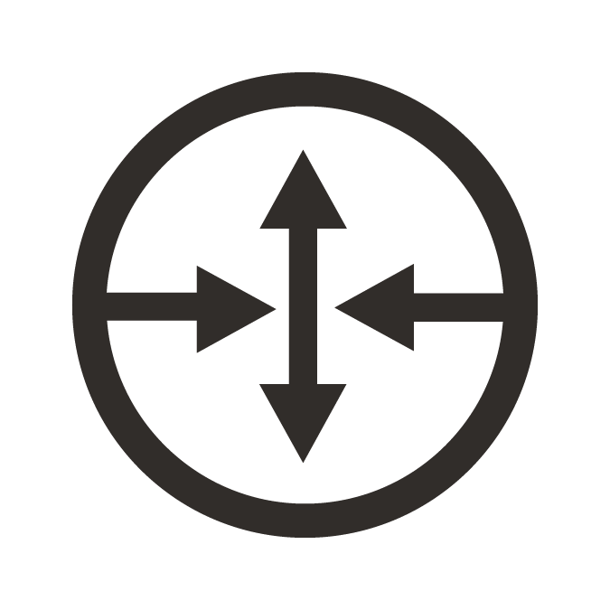
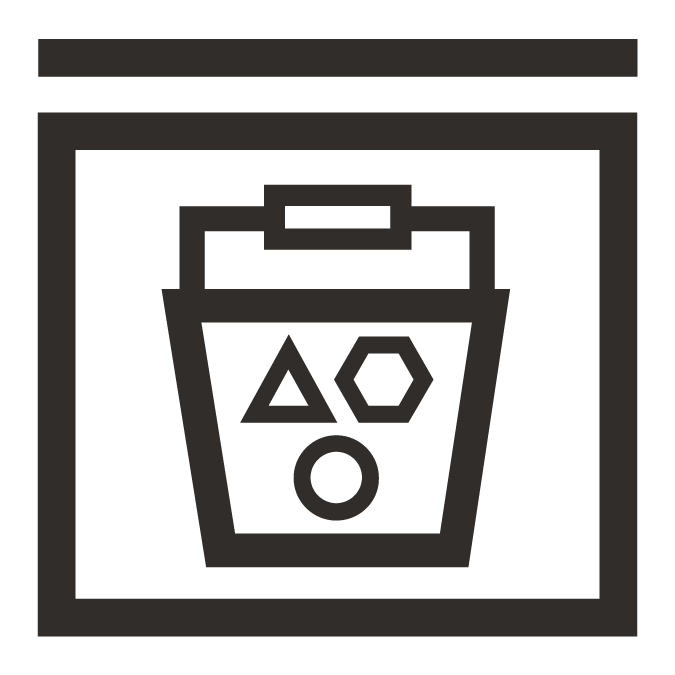

# onprem

## onprem.database
 **Cassandra**| **Clickhouse**, **ClickHouse** (alias)| **Cockroachdb**, **CockroachDB** (alias)| **Couchbase**| **Couchdb**, **CouchDB** (alias)| **Dgraph**| **Hbase**, **HBase** (alias)| **Influxdb**, **InfluxDB** (alias)| **Janusgraph**, **JanusGraph** (alias)| **Mariadb**, **MariaDB** (alias)| **Mongodb**, **MongoDB** (alias)| **Mssql**, **MSSQL** (alias)| **Mysql**, **MySQL** (alias)| **Neo4J**| **Oracle**| **Postgresql**, **PostgreSQL** (alias)| **Scylla**|
## onprem.security
 **Trivy**| **Vault**|
## onprem.ci
 **Circleci**, **CircleCI** (alias)| **Jenkins**| **Teamcity**, **TC** (alias)| **Travisci**, **TravisCI** (alias)|
## onprem.etl
 **Embulk**|
## onprem.mlops
 **Polyaxon**|
## onprem.network
 **Apache**| **Caddy**| **Consul**| **Envoy**| **Etcd**, **ETCD** (alias)| **Haproxy**, **HAProxy** (alias)| **Internet**| **Istio**| **Kong**| **Linkerd**| **Nginx**| **Pfsense**, **PFSense** (alias)| **Pomerium**| **Tomcat**| **Traefik**| **Vyos**, **VyOS** (alias)| **Zookeeper**|
## onprem.inmemory
 **Aerospike**| **Hazelcast**| **Memcached**| **Redis**|
## onprem.search
 **Elasticsearch**| **Solr**|
## onprem.container
 **Docker**| **Rkt**, **RKT** (alias)|
## onprem.iac
 **Ansible**| **Awx**| **Terraform**|
## onprem.compute
 **Nomad**| **Server**|
## onprem.vcs
 **Git**| **Github**| **Gitlab**|
## onprem.workflow
 **Airflow**| **Digdag**| **Kubeflow**, **KubeFlow** (alias)| **Nifi**, **NiFi** (alias)|
## onprem.queue
 **Activemq**, **ActiveMQ** (alias)| **Celery**| **Kafka**| **Rabbitmq**, **RabbitMQ** (alias)| **Zeromq**, **ZeroMQ** (alias)|
## onprem.cd
 **Spinnaker**|
## onprem.gitops
 **Argocd**, **ArgoCD** (alias)|
## onprem.monitoring
 **Datadog**| **Grafana**| **Kibana**| **Prometheus**| **Splunk**| **Thanos**|
## onprem.client
 **Client**| **User**| **Users**|
## onprem.logging
 **Fluentd**| **Logstash**, **LogStash** (alias)| **Loki**|
## onprem.analytics
 **Beam**| **Flink**| **Hadoop**| **Hive**| **Metabase**| **Norikra**| **Spark**| **Storm**| **Tableau**|
# aws

## aws.database
 **Aurora**| **DatabaseMigrationService**, **DMS** (alias)| **Database**, **DB** (alias)| **DocumentdbMongodbCompatibility**, **DocumentDB** (alias)| **Dynamodb**, **DDB** (alias)| **Elasticache**, **ElastiCache** (alias)| **Neptune**| **QuantumLedgerDatabaseQldb**, **QLDB** (alias)| **RDSOnVmware**| **RDS**| **Redshift**| **Timestream**|
## aws.security
 **Artifact**| **CertificateManager**, **ACM** (alias)| **CloudDirectory**| **Cloudhsm**, **CloudHSM** (alias)| **Cognito**| **DirectoryService**, **DS** (alias)| **FirewallManager**, **FMS** (alias)| **Guardduty**| **IdentityAndAccessManagementIam**, **IAM** (alias)| **Inspector**| **KeyManagementService**, **KMS** (alias)| **Macie**| **ResourceAccessManager**, **RAM** (alias)| **SecretsManager**| **SecurityHub**| **SecurityIdentityAndCompliance**| **Shield**| **SingleSignOn**| **WAF**|
## aws.integration
 **ApplicationIntegration**| **Appsync**| **ConsoleMobileApplication**| **Eventbridge**| **MQ**| **SimpleNotificationServiceSns**, **SNS** (alias)| **SimpleQueueServiceSqs**, **SQS** (alias)| **StepFunctions**, **SF** (alias)|
## aws.network
 **APIGateway**| **AppMesh**| **ClientVpn**| **CloudMap**| **CloudFront**, **CF** (alias)| **DirectConnect**| **ElasticLoadBalancing**, **ELB** (alias)| **Endpoint**| **GlobalAccelerator**, **GAX** (alias)| **InternetGateway**| **Nacl**| **NATGateway**| **NetworkingAndContentDelivery**| **PrivateSubnet**| **Privatelink**| **PublicSubnet**| **Route53**| **RouteTable**| **SiteToSiteVpn**| **TransitGateway**| **VPCPeering**| **VPCRouter**| **VPC**|
## aws.management
 **AutoScaling**| **Cloudformation**| **Cloudtrail**| **Cloudwatch**| **Codeguru**| **CommandLineInterface**| **Config**| **ControlTower**| **LicenseManager**| **ManagedServices**| **ManagementConsole**| **Opsworks**| **Organizations**| **ServiceCatalog**| **SystemsManagerParameterStore**, **ParameterStore** (alias)| **SystemsManager**, **SSM** (alias)| **TrustedAdvisor**| **WellArchitectedTool**|
## aws.storage
 **Backup**| **CloudendureDisasterRecovery**, **CDR** (alias)| **EFSInfrequentaccessPrimaryBg**| **EFSStandardPrimaryBg**| **ElasticBlockStoreEBS**, **EBS** (alias)| **ElasticFileSystemEFS**, **EFS** (alias)| **FsxForLustre**| **FsxForWindowsFileServer**| **Fsx**, **FSx** (alias)| **S3Glacier**| **SimpleStorageServiceS3**, **S3** (alias)| **SnowballEdge**| **Snowball**| **Snowmobile**| **StorageGateway**| **Storage**|
## aws.iot
 **Freertos**, **FreeRTOS** (alias)| **InternetOfThings**| **Iot1Click**| **IotAnalytics**| **IotButton**| **IotCore**| **IotDeviceDefender**| **IotDeviceManagement**| **IotEvents**| **IotGreengrass**| **IotSitewise**| **IotThingsGraph**|
## aws.engagement
 **Connect**| **Pinpoint**| **SimpleEmailServiceSes**, **SES** (alias)|
## aws.compute
 **ApplicationAutoScaling**, **AutoScaling** (alias)| **Batch**| **Compute**| **EC2ContainerRegistry**, **ECR** (alias)| **EC2**| **ElasticBeanstalk**, **EB** (alias)| **ElasticContainerService**, **ECS** (alias)| **ElasticKubernetesService**, **EKS** (alias)| **Fargate**| **Lambda**| **Lightsail**| **Outposts**| **ServerlessApplicationRepository**, **SAR** (alias)| **ThinkboxDeadline**| **ThinkboxDraft**| **ThinkboxFrost**| **ThinkboxKrakatoa**| **ThinkboxSequoia**| **ThinkboxStoke**| **ThinkboxXmesh**| **VmwareCloudOnAWS**|
## aws.devtools
 **CloudDevelopmentKit**| **Cloud9**| **Codebuild**| **Codecommit**| **Codedeploy**| **Codepipeline**| **Codestar**| **CommandLineInterface**, **CLI** (alias)| **DeveloperTools**, **DevTools** (alias)| **ToolsAndSdks**| **XRay**|
## aws.ml
 **ApacheMxnetOnAWS**| **Comprehend**| **DeepLearningAmis**| **DeepLearningContainers**, **DLC** (alias)| **Deeplens**| **Deepracer**| **ElasticInference**| **Forecast**| **Lex**| **MachineLearning**| **Personalize**| **Polly**| **Rekognition**| **SagemakerGroundTruth**| **Sagemaker**| **TensorflowOnAWS**| **Textract**| **Transcribe**| **Translate**|
## aws.migration
 **ApplicationDiscoveryService**, **ADS** (alias)| **CloudendureMigration**, **CEM** (alias)| **DatabaseMigrationService**, **DMS** (alias)| **Datasync**| **MigrationAndTransfer**, **MAT** (alias)| **MigrationHub**| **ServerMigrationService**, **SMS** (alias)| **SnowballEdge**| **Snowball**| **Snowmobile**| **TransferForSftp**|
## aws.analytics
 **Analytics**| **Athena**| **CloudsearchSearchDocuments**| **Cloudsearch**| **DataPipeline**| **ElasticsearchService**, **ES** (alias)| **EMRCluster**| **EMRHdfsCluster**| **EMR**| **GlueCrawlers**| **GlueDataCatalog**| **Glue**| **KinesisDataAnalytics**| **KinesisDataFirehose**| **KinesisDataStreams**| **KinesisVideoStreams**| **Kinesis**| **LakeFormation**| **ManagedStreamingForKafka**| **Quicksight**| **RedshiftDenseComputeNode**| **RedshiftDenseStorageNode**| **Redshift**|
## aws.media
 **ElasticTranscoder**| **ElementalConductor**| **ElementalDelta**| **ElementalLive**| **ElementalMediaconnect**| **ElementalMediaconvert**| **ElementalMedialive**| **ElementalMediapackage**| **ElementalMediastore**| **ElementalMediatailor**| **ElementalServer**|
# azure

## azure.database
 **BlobStorage**| **CacheForRedis**| **CosmosDb**| **DataLake**| **DatabaseForMariadbServers**| **DatabaseForMysqlServers**| **DatabaseForPostgresqlServers**| **ElasticDatabasePools**| **ElasticJobAgents**| **ManagedDatabases**| **SQLDatabases**| **SQLDatawarehouse**| **SQLManagedInstances**| **SQLServerStretchDatabases**| **SQLServers**| **VirtualClusters**| **VirtualDatacenter**|
## azure.devops
 **ApplicationInsights**| **Artifacts**| **Boards**| **Devops**| **DevtestLabs**| **Pipelines**| **Repos**| **TestPlans**|
## azure.identity
 **AccessReview**| **ActiveDirectoryConnectHealth**| **ActiveDirectory**| **ADB2C**| **ADDomainServices**| **ADIdentityProtection**| **ADPrivilegedIdentityManagement**| **AppRegistrations**| **ConditionalAccess**| **EnterpriseApplications**| **IdentityGovernance**| **InformationProtection**| **ManagedIdentities**|
## azure.security
 **KeyVaults**| **SecurityCenter**| **Sentinel**|
## azure.web
 **APIConnections**| **AppServiceCertificates**| **AppServiceDomains**| **AppServiceEnvironments**| **AppServicePlans**| **AppServices**| **MediaServices**| **NotificationHubNamespaces**| **Search**| **Signalr**|
## azure.network
 **ApplicationGateway**| **ApplicationSecurityGroups**| **CDNProfiles**| **Connections**| **DDOSProtectionPlans**| **DNSPrivateZones**| **DNSZones**| **ExpressrouteCircuits**| **Firewall**| **FrontDoors**| **LoadBalancers**| **LocalNetworkGateways**| **NetworkInterfaces**| **NetworkSecurityGroupsClassic**| **NetworkWatcher**| **OnPremisesDataGateways**| **PublicIpAddresses**| **ReservedIpAddressesClassic**| **RouteFilters**| **RouteTables**| **ServiceEndpointPolicies**| **TrafficManagerProfiles**| **VirtualNetworkClassic**| **VirtualNetworkGateways**| **VirtualNetworks**| **VirtualWans**|
## azure.storage
 **ArchiveStorage**| **Azurefxtedgefiler**| **BlobStorage**| **DataBoxEdgeDataBoxGateway**| **DataBox**| **DataLakeStorage**| **GeneralStorage**| **NetappFiles**| **QueuesStorage**| **StorageAccountsClassic**| **StorageAccounts**| **StorageExplorer**| **StorageSyncServices**| **StorsimpleDataManagers**| **StorsimpleDeviceManagers**| **TableStorage**|
## azure.iot
 **DeviceProvisioningServices**| **DigitalTwins**| **IotCentralApplications**| **IotHubSecurity**| **IotHub**| **Maps**| **Sphere**| **TimeSeriesInsightsEnvironments**| **TimeSeriesInsightsEventsSources**| **Windows10IotCoreServices**|
## azure.compute
 **AvailabilitySets**| **BatchAccounts**| **CitrixVirtualDesktopsEssentials**| **CloudServicesClassic**| **CloudServices**| **CloudsimpleVirtualMachines**| **ContainerInstances**| **ContainerRegistries**, **ACR** (alias)| **DiskSnapshots**| **Disks**| **FunctionApps**| **KubernetesServices**, **AKS** (alias)| **MeshApplications**| **SAPHANAOnAzure**| **ServiceFabricClusters**| **VMClassic**| **VMImages**| **VMLinux**| **VMWindows**| **VM**|
## azure.ml
 **BatchAI**| **BotServices**| **CognitiveServices**| **GenomicsAccounts**| **MachineLearningServiceWorkspaces**| **MachineLearningStudioWebServicePlans**| **MachineLearningStudioWebServices**| **MachineLearningStudioWorkspaces**|
## azure.mobile
 **AppServiceMobile**| **MobileEngagement**| **NotificationHubs**|
## azure.migration
 **DatabaseMigrationServices**| **MigrationProjects**| **RecoveryServicesVaults**|
## azure.analytics
 **AnalysisServices**| **DataExplorerClusters**| **DataFactories**| **DataLakeAnalytics**| **DataLakeStoreGen1**| **Databricks**| **EventHubClusters**| **EventHubs**| **Hdinsightclusters**| **LogAnalyticsWorkspaces**| **StreamAnalyticsJobs**|
# gcp

## gcp.database
 **Bigtable**, **BigTable** (alias)| **Datastore**| **Firestore**| **Memorystore**| **Spanner**| **SQL**|
## gcp.security
 **Iam**| **IAP**| **KeyManagementService**, **KMS** (alias)| **ResourceManager**| **SecurityCommandCenter**, **SCC** (alias)| **SecurityScanner**|
## gcp.network
 **Armor**| **CDN**| **DedicatedInterconnect**| **DNS**| **ExternalIpAddresses**| **FirewallRules**| **LoadBalancing**| **NAT**| **Network**| **PartnerInterconnect**| **PremiumNetworkTier**| **Router**| **Routes**| **StandardNetworkTier**| **TrafficDirector**| **VirtualPrivateCloud**, **VPC** (alias)| **VPN**|
## gcp.storage
 **Filestore**| **PersistentDisk**| **Storage**, **GCS** (alias)|
## gcp.iot
 **IotCore**|
## gcp.compute
 **AppEngine**, **GAE** (alias)| **ComputeEngine**, **GCE** (alias)| **ContainerOptimizedOS**| **Functions**, **GCF** (alias)| **GKEOnPrem**| **GPU**| **KubernetesEngine**, **GKE** (alias)| **Run**|
## gcp.devtools
 **Build**| **CodeForIntellij**| **Code**| **ContainerRegistry**, **GCR** (alias)| **GradleAppEnginePlugin**| **IdePlugins**| **MavenAppEnginePlugin**| **Scheduler**| **SDK**| **SourceRepositories**| **Tasks**| **TestLab**| **ToolsForEclipse**| **ToolsForPowershell**| **ToolsForVisualStudio**|
## gcp.ml
 **AdvancedSolutionsLab**| **AIHub**| **AIPlatformDataLabelingService**| **AIPlatform**| **AutomlNaturalLanguage**| **AutomlTables**| **AutomlTranslation**| **AutomlVideoIntelligence**| **AutomlVision**| **Automl**, **AutoML** (alias)| **DialogFlowEnterpriseEdition**| **InferenceAPI**| **JobsAPI**| **NaturalLanguageAPI**, **NLAPI** (alias)| **RecommendationsAI**| **SpeechToText**, **STT** (alias)| **TextToSpeech**, **TTS** (alias)| **TPU**| **TranslationAPI**| **VideoIntelligenceAPI**| **VisionAPI**|
## gcp.migration
 **TransferAppliance**|
## gcp.analytics
 **Bigquery**, **BigQuery** (alias)| **Composer**| **DataCatalog**| **DataFusion**| **Dataflow**| **Datalab**| **Dataprep**| **Dataproc**| **Genomics**| **Pubsub**, **PubSub** (alias)|
# k8s

## k8s.rbac
 **CRole**, **ClusterRole** (alias)| **CRB**, **ClusterRoleBinding** (alias)| **Group**| **RB**, **RoleBinding** (alias)| **Role**| **SA**, **ServiceAccount** (alias)| **User**|
## k8s.infra
 **ETCD**| **Master**| **Node**|
## k8s.podconfig
 **CM**, **ConfigMap** (alias)| **Secret**|
## k8s.group
 **NS**, **Namespace** (alias)|
## k8s.network
 **Ep**, **Endpoint** (alias)| **Ing**, **Ingress** (alias)| **Netpol**, **NetworkPolicy** (alias)| **SVC**, **Service** (alias)|
## k8s.others
 **CRD**| **PSP**|
## k8s.storage
 **PV**, **PersistnetVolume** (alias)| **PVC**, **PersistentVolumeClaim** (alias)| **SC**, **StorageClass** (alias)| **Vol**, **Volume** (alias)|
## k8s.clusterconfig
 **HPA**, **HorizontalPodAutoscaler** (alias)| **Limits**, **LimitRange** (alias)| **Quota**|
## k8s.controlplane
 **API**, **APIServer** (alias)| **CCM**| **CM**, **ControllerManager** (alias)| **KProxy**, **KubeProxy** (alias)| **Kubelet**| **Sched**, **Scheduler** (alias)|
## k8s.compute
 **Cronjob**| **Deploy**, **Deployment** (alias)| **DS**, **DaemonSet** (alias)| **Job**| **Pod**| **RS**, **ReplicaSet** (alias)| **STS**, **StatefulSet** (alias)|
# alibabacloud

## alibabacloud.database
 **ApsaradbCassandra**| **ApsaradbHbase**| **ApsaradbMemcache**| **ApsaradbMongodb**| **ApsaradbOceanbase**| **ApsaradbPolardb**| **ApsaradbPostgresql**| **ApsaradbPpas**| **ApsaradbRedis**| **ApsaradbSqlserver**| **DataManagementService**, **DMS** (alias)| **DataTransmissionService**, **DTS** (alias)| **DatabaseBackupService**, **DBS** (alias)| **DisributeRelationalDatabaseService**, **DRDS** (alias)| **GraphDatabaseService**, **GDS** (alias)| **HybriddbForMysql**| **RelationalDatabaseService**, **RDS** (alias)|
## alibabacloud.security
 **AntiBotService**, **ABS** (alias)| **AntiDdosBasic**| **AntiDdosPro**| **AntifraudService**, **AS** (alias)| **BastionHost**| **CloudFirewall**, **CFW** (alias)| **CloudSecurityScanner**| **ContentModeration**, **CM** (alias)| **CrowdsourcedSecurityTesting**| **DataEncryptionService**, **DES** (alias)| **DbAudit**| **GameShield**| **IdVerification**| **ManagedSecurityService**| **SecurityCenter**| **ServerGuard**| **SslCertificates**| **WebApplicationFirewall**, **WAF** (alias)|
## alibabacloud.web
 **Dns**| **Domain**|
## alibabacloud.network
 **Cdn**| **CloudEnterpriseNetwork**, **CEN** (alias)| **ElasticIpAddress**, **EIP** (alias)| **ExpressConnect**| **NatGateway**| **ServerLoadBalancer**, **SLB** (alias)| **SmartAccessGateway**| **VirtualPrivateCloud**, **VPC** (alias)| **VpnGateway**|
## alibabacloud.storage
 **CloudStorageGateway**| **FileStorageHdfs**, **HDFS** (alias)| **FileStorageNas**, **NAS** (alias)| **HybridBackupRecovery**, **HBR** (alias)| **HybridCloudDisasterRecovery**, **HDR** (alias)| **Imm**| **ObjectStorageService**, **OSS** (alias)| **ObjectTableStore**, **OTS** (alias)|
## alibabacloud.iot
 **IotInternetDeviceId**| **IotLinkWan**| **IotMobileConnectionPackage**| **IotPlatform**|
## alibabacloud.compute
 **AutoScaling**, **ESS** (alias)| **BatchCompute**| **ContainerRegistry**| **ContainerService**| **ElasticComputeService**, **ECS** (alias)| **ElasticContainerInstance**, **ECI** (alias)| **ElasticHighPerformanceComputing**, **EHPC** (alias)| **ElasticSearch**| **FunctionCompute**, **FC** (alias)| **OperationOrchestrationService**, **OOS** (alias)| **ResourceOrchestrationService**, **ROS** (alias)| **ServerLoadBalancer**, **SLB** (alias)| **ServerlessAppEngine**, **SAE** (alias)| **SimpleApplicationServer**, **SAS** (alias)| **WebAppService**, **WAS** (alias)|
## alibabacloud.application
 **ApiGateway**| **BeeBot**| **BlockchainAsAService**| **CloudCallCenter**| **CodePipeline**| **DirectMail**| **LogService**, **SLS** (alias)| **MessageNotificationService**, **MNS** (alias)| **NodeJsPerformancePlatform**| **OpenSearch**| **PerformanceTestingService**, **PTS** (alias)| **RdCloud**| **SmartConversationAnalysis**, **SCA** (alias)| **Yida**|
## alibabacloud.communication
 **DirectMail**| **MobilePush**|
## alibabacloud.analytics
 **AnalyticDb**| **ClickHouse**| **DataLakeAnalytics**| **ElaticMapReduce**| **OpenSearch**|
# oci

## oci.database
 **DatabaseserviceGrey**, **DBServiceGrey** (alias)| **Databaseservice**, **DBService** (alias)|
## oci.devops
 **ApiserviceGrey**| **Apiservice**| **ResourcemgmtGrey**| **Resourcemgmt**|
## oci.connectivity
 **BackboneGrey**| **Backbone**| **CustomerdatacenterGrey**| **Customerdatacenter**| **CustomerpremisesequipGrey**| **Customerpremisesequip**| **FastconnectGrey**| **Fastconnect**| **VpnGrey**| **Vpn**|
## oci.security
 **AuditGrey**| **Audit**| **CompartmentsGrey**| **Compartments**| **DdosGrey**| **Ddos**| **EncryptionGrey**| **Encryption**| **GroupsGrey**| **Groups**| **IdAccessGrey**| **IdAccess**| **KeymgmtGrey**| **Keymgmt**| **OcidGrey**| **Ocid**| **PoliciesGrey**| **Policies**| **TaggingGrey**| **Tagging**|
## oci.network
 **DrgGrey**| **Drg**| **FirewallGrey**| **Firewall**| **InternetgatewayGrey**| **Internetgateway**| **LoadbalanceGrey**| **Loadbalance**| **RoutetableGrey**| **Routetable**| **SecuritylistsGrey**| **Securitylists**| **ServiceGatewayGrey**| **ServiceGateway**| **VcloudnetworkGrey**| **Vcloudnetwork**|
## oci.edge
 **CdnGrey**| **Cdn**| **DnsGrey**| **Dns**| **EmaildeliveryGrey**| **Emaildelivery**| **WafGrey**| **Waf**|
## oci.storage
 **BackuprestoreGrey**| **Backuprestore**| **BlockstorageGrey**| **Blockstorage**| **BucketsGrey**| **Buckets**| **DatatransferGrey**| **Datatransfer**| **FilestorageGrey**| **Filestorage**| **ObjectstorageGrey**| **Objectstorage**| **StoragegatewayGrey**| **Storagegateway**|
## oci.compute
 **BmGrey**, **BareMetalGrey** (alias)| **Bm**, **BareMetal** (alias)| **ContainerGrey**| **Container**| **VmGrey**, **VirtualMachineGrey** (alias)| **Vm**, **VirtualMachine** (alias)|
## oci.monitoring
 **AlarmGrey**| **Alarm**| **EventGrey**| **Event**| **HealthcheckGrey**| **Healthcheck**| **LoggingGrey**| **Logging**| **NotificationsGrey**| **Notifications**| **QueuingGrey**| **Queuing**| **SearchGrey**| **Search**| **StreamingGrey**| **Streaming**| **TelemetryGrey**| **Telemetry**| **WorkflowGrey**| **Workflow**|
# programming

## programming.framework
 **Angular**| **Backbone**| **Django**| **Ember**| **Flask**| **Flutter**| **Laravel**| **Rails**| **React**| **Spring**| **Vue**|
## programming.language
 **Bash**| **C**| **Cpp**| **Csharp**| **Dart**| **Go**| **Java**| **Javascript**, **JavaScript** (alias)| **Kotlin**| **Matlab**| **Nodejs**, **NodeJS** (alias)| **Php**, **PHP** (alias)| **Python**| **R**| **Ruby**| **Swift**| **Typescript**, **TypeScript** (alias)|