# onprem

## onprem.amadeus
Api, Coorporations, Unicorn, Adds, AaDiamongRating, AccessControl, AdExchange, AddToCalendar, Add, Adserver, AdvancedPlatforms, Advertiser, Advertising, AffiliateNetwork, Agency, Agenda, AirConditioning, Airlines, Airplane01, Airplane02, Airplane03, Airplane04, Airplane05, AirportExpressTrain, AirportOperations, AirportTower, Airport, Alarm, Algorithm, AllIndustries, AmadeusCareersIcon, AmadeusCareers, AmadeusCommercialIcon, AmadeusCommercial, AmadeusCorporate, AmadeusDevelopersIcon, AmadeusDevelopers, AmadeusWorkshop, Amadeus, AnnualGeneralMeeting, Apis, ApprovedIdea, Approved, ArrowBack, ArrowDown, ArrowForward, ArrowUp, Article, ArtificialNtelligence, AskQuestions, AttachFile, Attachment, Audience, Audio, AutomaticTransmission, Award, Backpacker, BadWeatherConditions, Bank, Banner, Bar, Bay, BestAvailableRate, BestRateInCategory, Bicycle02, Bicycle, BigBang, BigData02, BigData, BinocularsSearch, Blacklinsting, Blind, Blockchain, BoardMeeting, BoatTransfers, Bookability, BookingAnalytics, BookingFileNavigationButton, BookingFile, Books, Box01, Box02, Breakfast, Building, BullEye, Bus01, Bus02, Bus03, BusinessCentre, BusinessOperations, BusinessRole, BusinessTravelAgencies02, BusinessTravelAgencies, BussinessCentre01, Calendar, Camera, CancelledFlight, Car01, Car02, Car03, CarCompanies, CarDriver, Cash, Challenge02, Challenge, Change, Chart, Chat, CheckList, Check, Checklist, ChessPiece, ChildSeat, Child, City, ClassifyInformation, ClickThroughRate, Click, Clipboard, Clock, Close02, Close, Cloud02, Cloud, CnmvFilings, Co2, Coach, Code, Coffee01, Coffee02, CommandPage01, CommandPage02, CommunitySupport, Company, ConfidentialMode, Connected02, ConnectedPerson, ConnectedTravel, Connected, Content02, ContentManagement, Content, ContractOrdering, Control, ConversionAttribution, ConversionRate, Conversion, CopyLink, Copy, CorporateGovernance, Corporate, Corporations, CostDown, Counter, Creativity, CrossDevice, CrossReference, Cruise02, Cruise, CsvFile, Culture, Cupcake, Currency, CustomerCentric, CustomerExperience, CustomerSatisfaction01, CustomerSatisfaction02, Customization, CyberFingerprint, CyberSearch, CyberSecurity, Cycle, Data01, Data02, DataCentreErding, DataDrivenAdvertising, DataMarketPlatform, DataPartnership, Database, Deaf, DebtAndRating, Delete, DemandGeneration, DemandSidePlatform, DepartureControl, DesktopPc, DestinationMarketingOrganization, Developer01, Developer02, DevelopersGroup01, DevelopersGroup02, DigitalFootprint, Directions, Disability, Disaster, Diversity, Dmos, Done, DoorOpen, Download02, Download, DragHandle, Driver, Dynamic, Edit, Efficiency, Elder, Email02, Email, Emergency, EngagementSurvey, Engagement, Entertainment, Environment, EquityPlans, Erlenmeyer, ErrorPopUp, Error, EstateCar, EventPlanning, Events, ExactMatch, ExchangeTicket, ExcludedOfPolicy, Exclusivity, ExpandCollapse01, ExpandCollapse02, Explore, ExternalLink, ExtraBag, Facebook02, Facebook, Factory, Family, FastBaggageCheckIn, FastTrack, Feedback, FemaSafetyCompliance, Ferry, FileProperties, File, FiletypeAudio, FiletypeDocument, FiletypeExcel, FiletypeGraph, FiletypeInfographic, FiletypeOther, FiletypePdf, FiletypePhoto, FiletypeVideo, Filter, Finance, FinancialCalendar, FinancialInformation, FinancialReport, Findability, Fingerprint, Flame, FlightDelay, Food, FourWheelDrive, FullService, GasPump, Gateway, Gds, Gears, GenericStarRating, Glassdoor, GlobalImpact, Globe01, Globe02, Gloves, GoToNext, GoogleAdwords, GooglePlus, GooglePlus2, GreenEnergy, GroundHandlersGroundOperations, GroundHandlers, GroundTransportation, Group, HealthClub, Heart, Helicopter, Home, Hospitality, Hotel01, Hotel02, Hotel03, Hotel04, Hotels, House, IdeaExpertise, InPolicyOutOfPolicy, IndustryRelations, IndustryUpdates, Infant, Information, Innovation02, Innovation, Insights, Instagram, Insurance, Interface01, Interface02, Internet, InvestorRelations, ItSolutions, KeyboardArrowDown, KeyboardArrowLeft, KeyboardArrowRight, KeyboardArrowUp, Keyboard, Keys, KnowledgeSharing, Knowledge, Language, LastMinute, LaundryService, Laurel, Lavatory, Learning, Leaves, LegendOfMapMarker, Leisure01, Leisure02, Lift, LightBulb, Like, Limo, Linkedin02, Linkedin, LiveTravelSpace, LocationPin, Location, LostLuggage, LoungeAccess, Luggage01, Luggage02, MachineLearning, Man, Manager01, Manager02, ManualTransmission, Map, MarketShare, Meal, MediaConnected, MedicalAssistance, MeetingRoom, MeetingRooms, Megaphone, Menu, MetaSearch, Metasearch, MicroChip, MissedConnection, Mobile02, MobileAdvertising, Mobile, Mobility, Monetization, MoneyBag02, MoneyBagWithCurrencyIndication, MoneyBag, MoreActions, Morphing, Motocycle, Mountains, Mouse, Music, MutualExchange, Nationalities, NativeAdvertising, NavbarExpand, Ndc, NegotiatedRatesAvailable, Network01, Network02, Network03, NewWindow, NoBreakfast, NoPreview, Notifications, NumberOfPassangers, Observatory, Offices, Oil, OnlineBooking, OnlineConversion, OnlineTraining, OnlineTravelAgencies02, OnlineTravelAgencies, OpenSource, Open, Operations, Optimization, OrganChart, OriginAndDestination, Paris, Parking, Passengers, Passport, PaymentCompanies, Payment, Payments, PcHookupInRoom, PcScreen, Pencil, People, PercentageTag, PetsAccepted, Phone02, Phone, Photo, Picture, Pictures, PiggyBank, Pinterest, PlayArrow, PlayCircle, Plug, Portal, Prediction, Preferred, Present, Press, PriceBenchmark, PriceTag01, PriceTag02, Print02, Print, Privacy, PrivateJet, PrivateNetwork, Prize02, Prize, Process, Profile01, Profile02, Profile03, Profile04, ProfileWoman, ProgrammaticAdvertising, Prototype, Publisher, PulseSurvey, Purchase, Puzzle02, Puzzle, Q1Expectation, Q10BestFriend, Q11Progress, Q12LearnAndGrow, Q2MaterialAndEquipment, Q3DoBest, Q4Recognition, Q5Development, Q7OpinionsCount, Q8MissionAndPurpose, QrCodes, Question, Rail, Railways, Ranking, RegulatoryBodies, Relevance, RemoteWork, Remove, Reply, Report, Reporting, Research02, Research, Reservation, Reset, ResponseTime, Restaurant, RetailTravelAgencies02, RetailTravelAgencies, RevenuesUp, Robot, Rocket, Route, SadFace, SafeDepBox, Sail, SalesAndRevenue, SalesMarketing, SatNav, SatisfactionEmoticonsDissatisfied, SatisfactionEmoticonsSatisfied, SatisfactionEmoticonsSomewhatSatisfied, SatisfactionEmoticonsVeryDissatisfied, SatisfactionEmoticonsVerySatisfied, SaveAndConfirm, ScheduleChange, Schedule, SearchFlight, SearchTravel, Search, Seat, Security, SelectArrow, Select, Selfie, SendEmail, ServerAccept, ServerCancel, ServerEmpty, ServerRun, ServerSecurity, ServerStop, Server, ServicesConsulting, Settings, Share02, ShareInformation, Share, SharedTransfer, Shopping, Sitemap, Smiley, Snack, SocialMedia01, SocialMedia, Sort, Spa, Speech, Speed, Speedometer, SportsEquipment, StaffBonus, Staircase, StockHigh, StockLow, StockVolume, StopWatch, Strategy, Strike, StudentGraduates, SupplySidePlatform, Support02, Support, Survey, Sustainability, SwimmingPool, Tablet02, Tablet, Tap, TargetGroup, Targeting, Taxi, TeamWork, Technology02, TechnologyRole, Technology, Terminal, Thermometer, Thief, Thoughts, Thumbnail, Ticket02, TicketImage01, TicketImage02, TicketImage03, Ticket, Time, TireChain, Toilets, Tools, Torch, TourOperators, Traba, TradeFair, TrafficAquisition, Transfer01, Transfer02, TransfersDriver, Transportation, TravelAgency01, TravelAgency02, TravelAgency03, TravelAgentBusiness, TravelInsurance, TravelIntelligence02, TravelIntelligence, TravelIntent, TravelSearchCompanies, Travelcast, TravellerManagement, Traveller, Tree, Tribe, Truck, Tv, TwitterOutline, Twitter, TwoSeaterCar, Umbrella, UnaccompaniedMinor, Unicorn02, University, Upgrade, UsbKey, UserQuestion, UserValidate01, UserValidate02, ValueTag01, ValueTag02, Ventures, VersionHistory, VerticalBar, VideoAdvertising, Video, Vip, Visa, Warning, Water, WeaponsControl, Weather, Wellbeingprograms, WifiAvailable, Wifi, Woman, Workdesk, Working, WorldTravel01, WorldTravel02, WorldwideConnection, Worldwide, Write, WrittingSet, XmlFeed, You, Youtube02, Youtube  
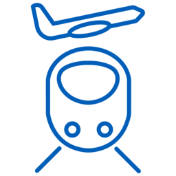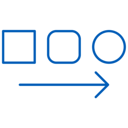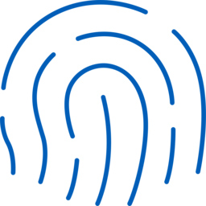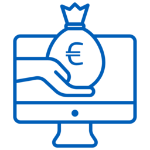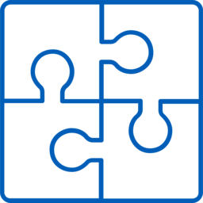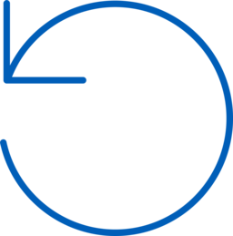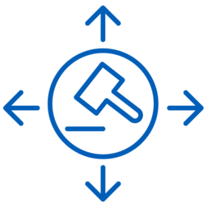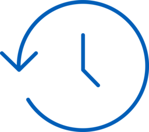

## onprem.analytics
Beam, Dbt, Flink, Hadoop, Hive, Metabase, Norikra, Singer, Spark, Storm, Tableau  

## onprem.cd
Spinnaker, TektonCli, Tekton  

## onprem.ci
Circleci, Concourseci, Gitlabci, Jenkins, Teamcity, Travisci, Zuulci  

## onprem.client
Client, User, Users  

## onprem.compute
Nomad, Server  

## onprem.container
Docker, Rkt  

## onprem.database
Cassandra, Clickhouse, Cockroachdb, Couchbase, Couchdb, Dgraph, Hbase, Influxdb, Janusgraph, Mariadb, Mongodb, Mssql, Mysql, Neo4J, Oracle, Postgresql, Scylla  

## onprem.etl
Embulk  

## onprem.gitops
Argocd, Flagger, Flux  

## onprem.iac
Ansible, Awx, Terraform  

## onprem.inmemory
Aerospike, Hazelcast, Memcached, Redis  

## onprem.logging
Fluentbit, Fluentd, Logstash, Loki  

## onprem.mlops
Polyaxon  

## onprem.monitoring
Datadog, Grafana, Kibana, Prometheus, Sentry, Splunk, Thanos  

## onprem.network
Apache, Caddy, Consul, Envoy, Etcd, Haproxy, Internet, Istio, Kong, Linkerd, Nginx, Pfsense, Pomerium, Tomcat, Traefik, Vyos, Zookeeper  

## onprem.queue
Activemq, Celery, Kafka, Rabbitmq, Zeromq  

## onprem.search
Elasticsearch, Solr  

## onprem.security
Trivy, Vault  

## onprem.vcs
Git, Github, Gitlab  

## onprem.workflow
Airflow, Digdag, Kubeflow, Nifi  

# aws

## aws.analytics
Analytics, Athena, CloudsearchSearchDocuments, Cloudsearch, DataPipeline, ElasticsearchService, EMRCluster, EMRHdfsCluster, EMR, GlueCrawlers, GlueDataCatalog, Glue, KinesisDataAnalytics, KinesisDataFirehose, KinesisDataStreams, KinesisVideoStreams, Kinesis, LakeFormation, ManagedStreamingForKafka, Quicksight, RedshiftDenseComputeNode, RedshiftDenseStorageNode, Redshift  

## aws.ar
Sumerian  

## aws.blockchain
ManagedBlockchain, QuantumLedgerDatabaseQldb  

## aws.business
AlexaForBusiness, Chime, Workmail  

## aws.compute
ApplicationAutoScaling, Batch, Compute, EC2ContainerRegistry, EC2, ElasticBeanstalk, ElasticContainerService, ElasticKubernetesService, Fargate, Lambda, Lightsail, Outposts, ServerlessApplicationRepository, ThinkboxDeadline, ThinkboxDraft, ThinkboxFrost, ThinkboxKrakatoa, ThinkboxSequoia, ThinkboxStoke, ThinkboxXmesh, VmwareCloudOnAWS  

## aws.cost
Budgets, CostAndUsageReport, CostExplorer, ReservedInstanceReporting, SavingsPlans  

## aws.database
Aurora, DatabaseMigrationService, Database, DocumentdbMongodbCompatibility, DynamodbDax, DynamodbGlobalSecondaryIndex, DynamodbTable, Dynamodb, Elasticache, Neptune, QuantumLedgerDatabaseQldb, RDSOnVmware, RDS, Redshift, Timestream  

## aws.devtools
CloudDevelopmentKit, Cloud9, Codebuild, Codecommit, Codedeploy, Codepipeline, Codestar, CommandLineInterface, DeveloperTools, ToolsAndSdks, XRay  

## aws.enablement
Iq, ManagedServices, ProfessionalServices, Support  

## aws.enduser
Appstream20, Workdocs, Worklink, Workspaces  
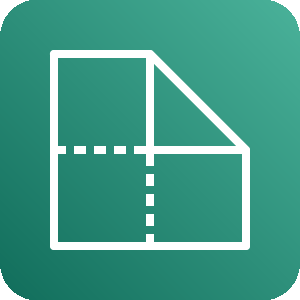

## aws.engagement
Connect, Pinpoint, SimpleEmailServiceSes  

## aws.game
Gamelift  

## aws.general
Disk, General, GenericDatabase, GenericFirewall, GenericOfficeBuilding, GenericSamlToken, GenericSDK, Marketplace, TradicionalServer, User, Users  

## aws.integration
ApplicationIntegration, Appsync, ConsoleMobileApplication, Eventbridge, MQ, SimpleNotificationServiceSns, SimpleQueueServiceSqs, StepFunctions  

## aws.iot
Freertos, InternetOfThings, Iot1Click, IotAction, IotAlexaEcho, IotAlexaSkill, IotAnalytics, IotButton, IotCamera, IotCertificate, IotCore, IotDeviceDefender, IotDeviceManagement, IotEvents, IotGreengrassConnector, IotGreengrass, IotHardwareBoard, IotHttp, IotHttp2, IotJobs, IotLambda, IotMqtt, IotPolicyEmergency, IotPolicy, IotRule, IotShadow, IotSitewise, IotThingsGraph, IotTopic  

## aws.management
AutoScaling, Cloudformation, Cloudtrail, Cloudwatch, Codeguru, CommandLineInterface, Config, ControlTower, LicenseManager, ManagedServices, ManagementConsole, Opsworks, Organizations, ServiceCatalog, SystemsManagerParameterStore, SystemsManager, TrustedAdvisor, WellArchitectedTool  

## aws.media
ElasticTranscoder, ElementalConductor, ElementalDelta, ElementalLive, ElementalMediaconnect, ElementalMediaconvert, ElementalMedialive, ElementalMediapackage, ElementalMediastore, ElementalMediatailor, ElementalServer  

## aws.migration
ApplicationDiscoveryService, CloudendureMigration, DatabaseMigrationService, Datasync, MigrationAndTransfer, MigrationHub, ServerMigrationService, SnowballEdge, Snowball, Snowmobile, TransferForSftp  

## aws.ml
ApacheMxnetOnAWS, Comprehend, DeepLearningAmis, DeepLearningContainers, Deeplens, Deepracer, ElasticInference, Forecast, Lex, MachineLearning, Personalize, Polly, Rekognition, SagemakerGroundTruth, SagemakerModel, SagemakerNotebook, SagemakerTrainingJob, Sagemaker, TensorflowOnAWS, Textract, Transcribe, Translate  

## aws.mobile
Amplify, APIGatewayEndpoint, APIGateway, Appsync, DeviceFarm, Pinpoint  
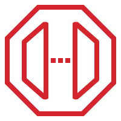

## aws.network
APIGateway, AppMesh, ClientVpn, CloudMap, CloudFront, DirectConnect, ElasticLoadBalancing, Endpoint, GlobalAccelerator, InternetGateway, Nacl, NATGateway, NetworkingAndContentDelivery, PrivateSubnet, Privatelink, PublicSubnet, Route53, RouteTable, SiteToSiteVpn, TransitGateway, VPCPeering, VPCRouter, VPC  

## aws.quantum
Braket  

## aws.robotics
RobomakerSimulator, Robomaker, Robotics  
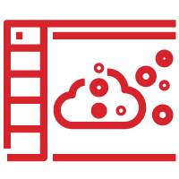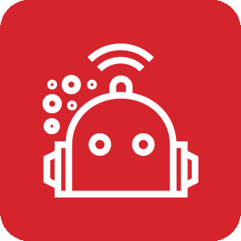

## aws.satellite
GroundStation  

## aws.security
Artifact, CertificateManager, CloudDirectory, Cloudhsm, Cognito, Detective, DirectoryService, FirewallManager, Guardduty, IdentityAndAccessManagementIamAccessAnalyzer, IdentityAndAccessManagementIamAWSSts, IdentityAndAccessManagementIamPermissions, IdentityAndAccessManagementIamRole, IdentityAndAccessManagementIam, Inspector, KeyManagementService, Macie, ResourceAccessManager, SecretsManager, SecurityHub, SecurityIdentityAndCompliance, Shield, SingleSignOn, WAF  

## aws.storage
Backup, CloudendureDisasterRecovery, EFSInfrequentaccessPrimaryBg, EFSStandardPrimaryBg, ElasticBlockStoreEBS, ElasticFileSystemEFS, FsxForLustre, FsxForWindowsFileServer, Fsx, S3Glacier, SimpleStorageServiceS3, SnowballEdge, Snowball, Snowmobile, StorageGateway, Storage  

# azure

## azure.analytics
AnalysisServices, DataExplorerClusters, DataFactories, DataLakeAnalytics, DataLakeStoreGen1, Databricks, EventHubClusters, EventHubs, Hdinsightclusters, LogAnalyticsWorkspaces, StreamAnalyticsJobs  

## azure.compute
AvailabilitySets, BatchAccounts, CitrixVirtualDesktopsEssentials, CloudServicesClassic, CloudServices, CloudsimpleVirtualMachines, ContainerInstances, ContainerRegistries, DiskSnapshots, Disks, FunctionApps, KubernetesServices, MeshApplications, SAPHANAOnAzure, ServiceFabricClusters, VMClassic, VMImages, VMLinux, VMWindows, VM  

## azure.database
BlobStorage, CacheForRedis, CosmosDb, DataLake, DatabaseForMariadbServers, DatabaseForMysqlServers, DatabaseForPostgresqlServers, ElasticDatabasePools, ElasticJobAgents, ManagedDatabases, SQLDatabases, SQLDatawarehouse, SQLManagedInstances, SQLServerStretchDatabases, SQLServers, VirtualClusters, VirtualDatacenter  

## azure.devops
ApplicationInsights, Artifacts, Boards, Devops, DevtestLabs, Pipelines, Repos, TestPlans  

## azure.general
Allresources, Azurehome, Developertools, Helpsupport, Information, Managementgroups, Marketplace, Quickstartcenter, Recent, Reservations, Resource, Resourcegroups, Servicehealth, Shareddashboard, Subscriptions, Support, Supportrequests, Tag, Tags, Templates, Twousericon, Userhealthicon, Usericon, Userprivacy, Userresource, Whatsnew  
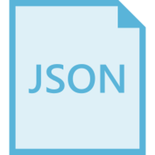

## azure.identity
AccessReview, ActiveDirectoryConnectHealth, ActiveDirectory, ADB2C, ADDomainServices, ADIdentityProtection, ADPrivilegedIdentityManagement, AppRegistrations, ConditionalAccess, EnterpriseApplications, IdentityGovernance, InformationProtection, ManagedIdentities  

## azure.integration
APIForFhir, APIManagement, AppConfiguration, DataCatalog, EventGridDomains, EventGridSubscriptions, EventGridTopics, IntegrationAccounts, IntegrationServiceEnvironments, LogicAppsCustomConnector, LogicApps, SendgridAccounts, ServiceBusRelays, ServiceBus, ServiceCatalogManagedApplicationDefinitions, SoftwareAsAService, StorsimpleDeviceManagers  
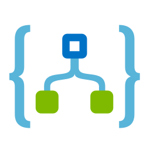

## azure.iot
DeviceProvisioningServices, DigitalTwins, IotCentralApplications, IotHubSecurity, IotHub, Maps, Sphere, TimeSeriesInsightsEnvironments, TimeSeriesInsightsEventsSources, Windows10IotCoreServices  

## azure.migration
DatabaseMigrationServices, MigrationProjects, RecoveryServicesVaults  

## azure.ml
BatchAI, BotServices, CognitiveServices, GenomicsAccounts, MachineLearningServiceWorkspaces, MachineLearningStudioWebServicePlans, MachineLearningStudioWebServices, MachineLearningStudioWorkspaces  

## azure.mobile
AppServiceMobile, MobileEngagement, NotificationHubs  

## azure.network
ApplicationGateway, ApplicationSecurityGroups, CDNProfiles, Connections, DDOSProtectionPlans, DNSPrivateZones, DNSZones, ExpressrouteCircuits, Firewall, FrontDoors, LoadBalancers, LocalNetworkGateways, NetworkInterfaces, NetworkSecurityGroupsClassic, NetworkWatcher, OnPremisesDataGateways, PublicIpAddresses, ReservedIpAddressesClassic, RouteFilters, RouteTables, ServiceEndpointPolicies, TrafficManagerProfiles, VirtualNetworkClassic, VirtualNetworkGateways, VirtualNetworks, VirtualWans  

## azure.security
KeyVaults, SecurityCenter, Sentinel  

## azure.storage
ArchiveStorage, Azurefxtedgefiler, BlobStorage, DataBoxEdgeDataBoxGateway, DataBox, DataLakeStorage, GeneralStorage, NetappFiles, QueuesStorage, StorageAccountsClassic, StorageAccounts, StorageExplorer, StorageSyncServices, StorsimpleDataManagers, StorsimpleDeviceManagers, TableStorage  

## azure.web
APIConnections, AppServiceCertificates, AppServiceDomains, AppServiceEnvironments, AppServicePlans, AppServices, MediaServices, NotificationHubNamespaces, Search, Signalr  

# gcp

## gcp.analytics
Bigquery, Composer, DataCatalog, DataFusion, Dataflow, Datalab, Dataprep, Dataproc, Genomics, Pubsub  

## gcp.compute
AppEngine, ComputeEngine, ContainerOptimizedOS, Functions, GKEOnPrem, GPU, KubernetesEngine, Run  

## gcp.database
Bigtable, Datastore, Firestore, Memorystore, Spanner, SQL  

## gcp.devtools
Build, CodeForIntellij, Code, ContainerRegistry, GradleAppEnginePlugin, IdePlugins, MavenAppEnginePlugin, Scheduler, SDK, SourceRepositories, Tasks, TestLab, ToolsForEclipse, ToolsForPowershell, ToolsForVisualStudio  

## gcp.iot
IotCore  

## gcp.migration
TransferAppliance  

## gcp.ml
AdvancedSolutionsLab, AIHub, AIPlatformDataLabelingService, AIPlatform, AutomlNaturalLanguage, AutomlTables, AutomlTranslation, AutomlVideoIntelligence, AutomlVision, Automl, DialogFlowEnterpriseEdition, InferenceAPI, JobsAPI, NaturalLanguageAPI, RecommendationsAI, SpeechToText, TextToSpeech, TPU, TranslationAPI, VideoIntelligenceAPI, VisionAPI  
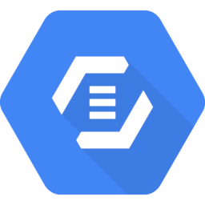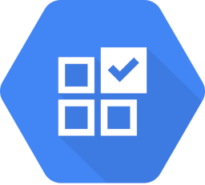

## gcp.network
Armor, CDN, DedicatedInterconnect, DNS, ExternalIpAddresses, FirewallRules, LoadBalancing, NAT, Network, PartnerInterconnect, PremiumNetworkTier, Router, Routes, StandardNetworkTier, TrafficDirector, VirtualPrivateCloud, VPN  

## gcp.security
Iam, IAP, KeyManagementService, ResourceManager, SecurityCommandCenter, SecurityScanner  

## gcp.storage
Filestore, PersistentDisk, Storage  

# firebase

## firebase.base
Firebase  

## firebase.develop
Authentication, Firestore, Functions, Hosting, MLKit, RealtimeDatabase, Storage  

## firebase.extentions
Extensions  

## firebase.grow
ABTesting, AppIndexing, DynamicLinks, InAppMessaging, Invites, Messaging, Predictions, RemoteConfig  

## firebase.quality
AppDistribution, CrashReporting, Crashlytics, PerformanceMonitoring, TestLab  

# k8s

## k8s.clusterconfig
HPA, Limits, Quota  

## k8s.compute
Cronjob, Deploy, DS, Job, Pod, RS, STS  

## k8s.controlplane
API, CCM, CM, KProxy, Kubelet, Sched  

## k8s.ecosystem
Helm, Krew, Kustomize  

## k8s.group
NS  

## k8s.infra
ETCD, Master, Node  

## k8s.network
Ep, Ing, Netpol, SVC  

## k8s.others
CRD, PSP  

## k8s.podconfig
CM, Secret  

## k8s.rbac
CRole, CRB, Group, RB, Role, SA, User  

## k8s.storage
PV, PVC, SC, Vol  

# alibabacloud

## alibabacloud.analytics
AnalyticDb, ClickHouse, DataLakeAnalytics, ElaticMapReduce, OpenSearch  

## alibabacloud.application
ApiGateway, BeeBot, BlockchainAsAService, CloudCallCenter, CodePipeline, DirectMail, LogService, MessageNotificationService, NodeJsPerformancePlatform, OpenSearch, PerformanceTestingService, RdCloud, SmartConversationAnalysis, Yida  

## alibabacloud.communication
DirectMail, MobilePush  

## alibabacloud.compute
AutoScaling, BatchCompute, ContainerRegistry, ContainerService, ElasticComputeService, ElasticContainerInstance, ElasticHighPerformanceComputing, ElasticSearch, FunctionCompute, OperationOrchestrationService, ResourceOrchestrationService, ServerLoadBalancer, ServerlessAppEngine, SimpleApplicationServer, WebAppService  

## alibabacloud.database
ApsaradbCassandra, ApsaradbHbase, ApsaradbMemcache, ApsaradbMongodb, ApsaradbOceanbase, ApsaradbPolardb, ApsaradbPostgresql, ApsaradbPpas, ApsaradbRedis, ApsaradbSqlserver, DataManagementService, DataTransmissionService, DatabaseBackupService, DisributeRelationalDatabaseService, GraphDatabaseService, HybriddbForMysql, RelationalDatabaseService  

## alibabacloud.iot
IotInternetDeviceId, IotLinkWan, IotMobileConnectionPackage, IotPlatform  

## alibabacloud.network
Cdn, CloudEnterpriseNetwork, ElasticIpAddress, ExpressConnect, NatGateway, ServerLoadBalancer, SmartAccessGateway, VirtualPrivateCloud, VpnGateway  

## alibabacloud.security
AntiBotService, AntiDdosBasic, AntiDdosPro, AntifraudService, BastionHost, CloudFirewall, CloudSecurityScanner, ContentModeration, CrowdsourcedSecurityTesting, DataEncryptionService, DbAudit, GameShield, IdVerification, ManagedSecurityService, SecurityCenter, ServerGuard, SslCertificates, WebApplicationFirewall  

## alibabacloud.storage
CloudStorageGateway, FileStorageHdfs, FileStorageNas, HybridBackupRecovery, HybridCloudDisasterRecovery, Imm, ObjectStorageService, ObjectTableStore  

## alibabacloud.web
Dns, Domain  

# oci

## oci.compute
BmGrey, Bm, ContainerGrey, Container, VmGrey, Vm  

## oci.connectivity
BackboneGrey, Backbone, CustomerdatacenterGrey, Customerdatacenter, CustomerpremisesequipGrey, Customerpremisesequip, FastconnectGrey, Fastconnect, VpnGrey, Vpn  

## oci.database
DatabaseserviceGrey, Databaseservice  

## oci.devops
ApiserviceGrey, Apiservice, ResourcemgmtGrey, Resourcemgmt  

## oci.edge
CdnGrey, Cdn, DnsGrey, Dns, EmaildeliveryGrey, Emaildelivery, WafGrey, Waf  

## oci.monitoring
AlarmGrey, Alarm, EventGrey, Event, HealthcheckGrey, Healthcheck, LoggingGrey, Logging, NotificationsGrey, Notifications, QueuingGrey, Queuing, SearchGrey, Search, StreamingGrey, Streaming, TelemetryGrey, Telemetry, WorkflowGrey, Workflow  

## oci.network
DrgGrey, Drg, FirewallGrey, Firewall, InternetgatewayGrey, Internetgateway, LoadbalanceGrey, Loadbalance, RoutetableGrey, Routetable, SecuritylistsGrey, Securitylists, ServiceGatewayGrey, ServiceGateway, VcloudnetworkGrey, Vcloudnetwork  

## oci.security
AuditGrey, Audit, CompartmentsGrey, Compartments, DdosGrey, Ddos, EncryptionGrey, Encryption, GroupsGrey, Groups, IdAccessGrey, IdAccess, KeymgmtGrey, Keymgmt, OcidGrey, Ocid, PoliciesGrey, Policies, TaggingGrey, Tagging  
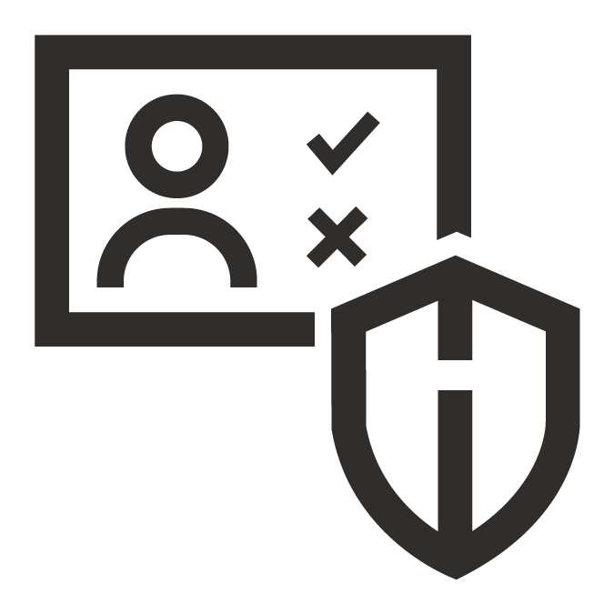

## oci.storage
BackuprestoreGrey, Backuprestore, BlockstorageGrey, Blockstorage, BucketsGrey, Buckets, DatatransferGrey, Datatransfer, FilestorageGrey, Filestorage, ObjectstorageGrey, Objectstorage, StoragegatewayGrey, Storagegateway  

# programming

## programming.framework
Angular, Backbone, Django, Ember, Flask, Flutter, Laravel, Rails, React, Spring, Vue  

## programming.language
Bash, C, Cpp, Csharp, Dart, Go, Java, Javascript, Kotlin, Matlab, Nodejs, Php, Python, R, Ruby, Rust, Swift, Typescript  

# saas

## saas.alerting
Opsgenie  

## saas.analytics
Stitch  

## saas.chat
Slack, Telegram  

## saas.social
Facebook, Twitter  

# elastic

## elastic.elasticsearch
Alerting, Beats, Elasticsearch, Kibana, Logstash, MachineLearning, Maps, Monitoring, SecuritySettings, Sql  

## elastic.enterprisesearch
AppSearch, EnterpriseSearch, SiteSearch, WorkplaceSearch  

## elastic.observability
APM, Logs, Metrics, Observability, Uptime  

## elastic.orchestration
ECE, ECK  

## elastic.security
Endpoint, Security, SIEM  

# generic

## generic.blank
Blank  

## generic.compute
Rack  

## generic.device
Mobile, Tablet  

## generic.network
Firewall, Router, Switch, VPN  

## generic.os
Android, Centos, IOS, LinuxGeneral, Suse, Ubuntu, Windows  

## generic.place
Datacenter  

## generic.storage
Storage  

## generic.virtualization
Virtualbox, Vmware, XEN  

